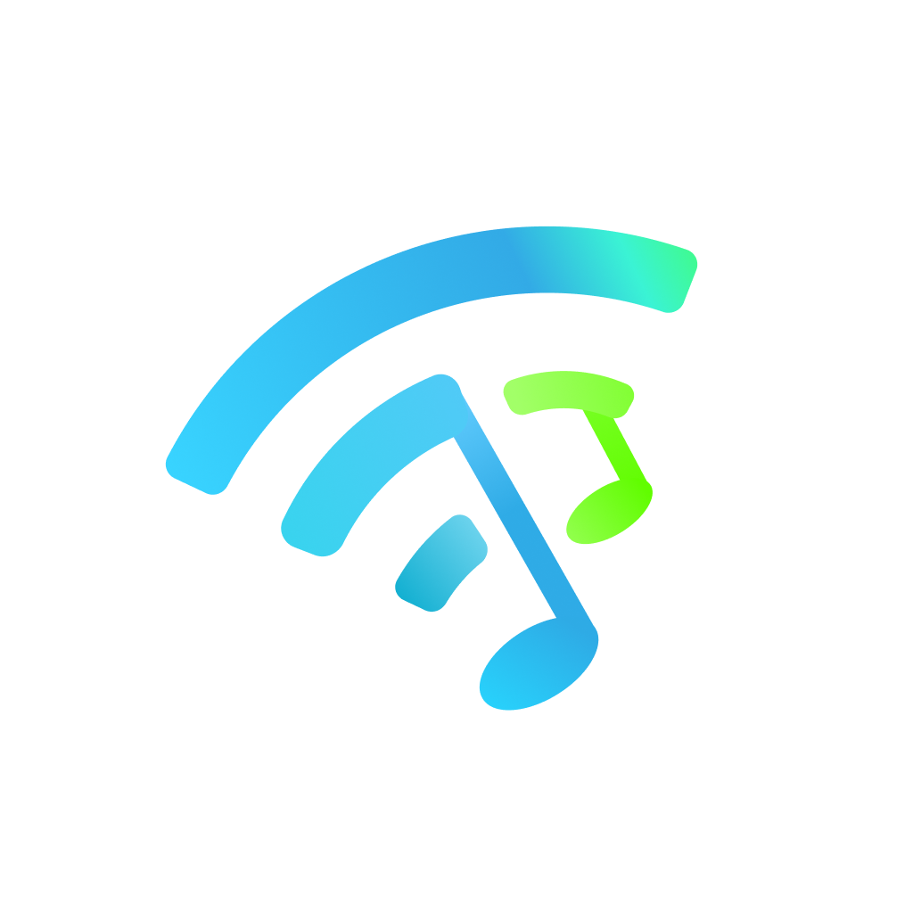
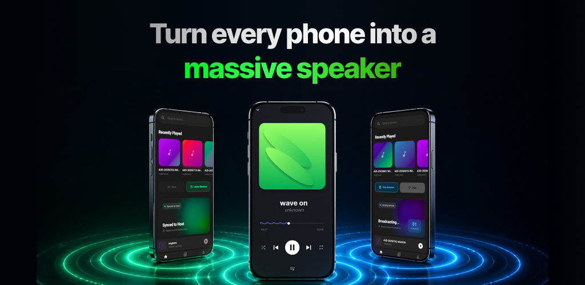
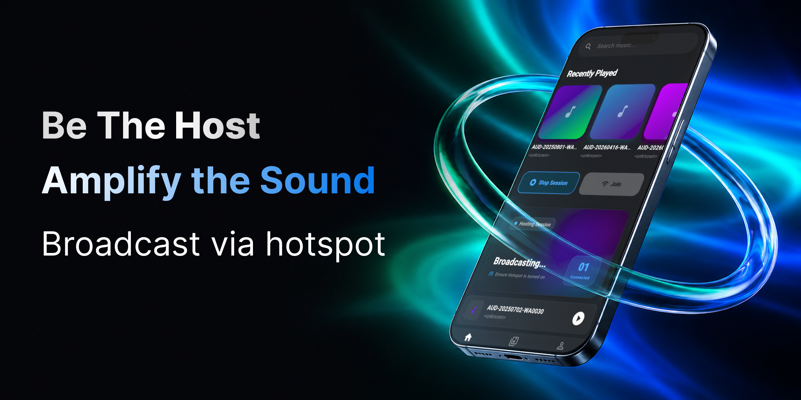
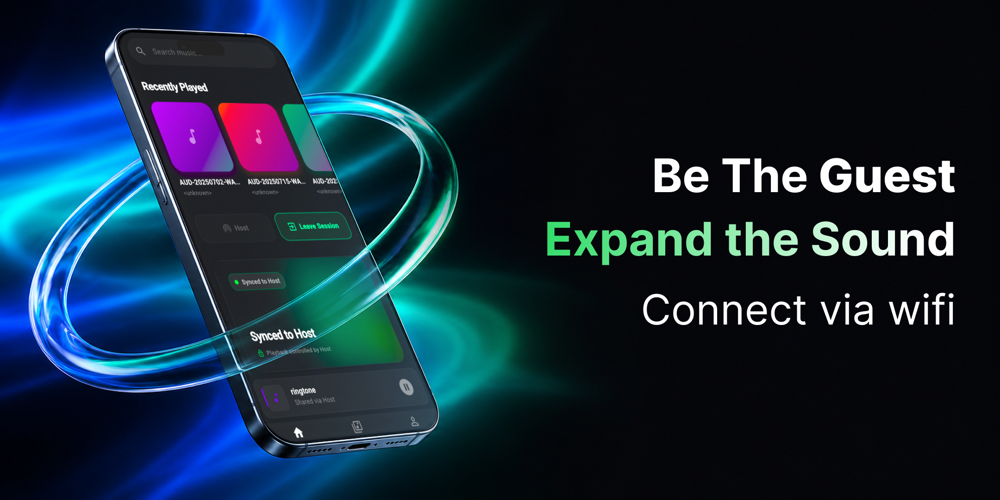

 ---


<p align="center">
  
</p>
<h1 align="center">Waveon</h1>



**Waveon** is a distributed audio playback engine built with Flutter. It allows multiple mobile devices to connect over a Local Area Network (LAN/Hotspot) and stream music in perfect synchronization, effectively turning a group of phones into a massive, decentralized speaker system.

> **Note on Repository Scope:** This repository is an architectural showcase designed for code review. It contains the complete UI implementation, state management logic, standard local networking (TCP Sockets & HTTP Servers), and Firebase integration. The core clock-offset calculation engine and native hardware execution triggers have been intentionally omitted to protect proprietary IP — available to reviewers on request.


## The Experience

### The Host



The Host acts as the central hub. By spinning up a local hotspot, the Host controls the playlist, serves the audio files, and broadcasts the synchronized execution timestamps. 

### The Guest



Guests simply connect to the Host's network. The app automatically primes the audio buffer in the background and hands over playback control to the Host for a seamless, hands-off listening experience.

---


## 🏗️ System Architecture

Synchronizing audio across multiple variable hardware devices over unstable Wi-Fi networks is a complex problem. Waveon solves this by avoiding cloud-server bottlenecks and handling all routing directly on the edge.

### 1. The Local Media Server
Mobile operating systems heavily restrict how files are shared between devices. Waveon bypasses this by utilizing the `shelf` package to spin up an **on-device HTTP Server (Port 8080)** on the Host device. 
* Audio files are read directly from the Host's local storage and streamed over the local network via chunked byte-ranges (`accept-ranges: bytes`), allowing Guests to buffer high-fidelity audio without waiting for full file transfers.
* Features an automated cache-purging system to prevent device storage bloat.

### 2. Bi-Directional TCP Sockets
All playback commands (Play, Pause, Seek, Skip) are broadcast via a custom **TCP Socket Service (Port 4000)**. 
* Ensures ultra-low latency command delivery.
* Implements defensive fallback mechanisms to gracefully handle dropped connections, socket timeouts, and dynamic IP resolution via `network_info_plus`.

### 3. Distributed Synchronization Engine *(Abstracted)*
To prevent the "stadium echo" effect caused by varying device processing speeds, Waveon utilizes a custom synchronization protocol inspired by the Network Time Protocol (NTP).
* Calculates Round-Trip Time (RTT) and determines one-way network latency.
* Establishes a synchronized clock offset between the Host and all Connected Guests.
* Schedules native audio execution commands via `just_audio` to fire at the exact same millisecond across all hardware.

### 4. Atomic Database Transactions
The authentication and user profile infrastructure leverages Firebase Auth and Firestore. 
* Utilizes `WriteBatch` and `runTransaction` to guarantee atomic database updates.
* Features aggressive cleanup logic for account deletion, including manual data rollbacks in the event of partial network failures.

---

## Tech Stack & Tooling
 
| Layer | Technology |
|---|---|
| **Framework** | Flutter (Dart) |
| **State Management** | Provider — decoupled UI and business logic |
| **Navigation** | GoRouter — reactive, state-based routing |
| **Networking** | `dart:io` raw sockets, `shelf` HTTP server, `network_info_plus` |
| **Audio** | `just_audio` (playback), `on_audio_query` (library), `audio_converter_native` (compression) |
| **Backend** | Firebase Authentication, Cloud Firestore |
| **UI/UX** | Native Canvas glassmorphism, shimmer loading states, custom form validation |
 
---

 
## 📁 Project Structure
 
```
lib/
├── auth/
│   ├── data/               # Auth service, username provider
│   └── views/              # Login, Register screens
├── core/
│   ├── nav/                # GoRouter configuration
│   ├── services/           # Audio conversion, history, permissions, wifi
│   └── enums.dart
├── home/
│   ├── library/            # Audio player, library & player providers
│   ├── views/              # Home, Library, Profile screens
│   └── models/             # CarouselItem, DataModel, LocalSong, UserModel
├── network/
│   ├── media_server.dart   # shelf HTTP server (Port 8080)
│   ├── session_manager.dart
│   └── socket_service.dart # TCP socket layer (Port 4000)
├── session/
│   ├── session_provider.dart
│   └── session_widget.dart
└── widgets/
    ├── players/            # CustomProgressBar, FullPlayer, ShellPlayer, WiggleSlider
    ├── carousel_card.dart
    ├── queue_sheet.dart
    └── ...                 # Supporting UI components
```
 
---
<p align="center">
<br>
  
  &nbsp;
</p>
<p align="center">
  Copyright &copy; 2026 tsumith. All Rights Reserved.
</p>
